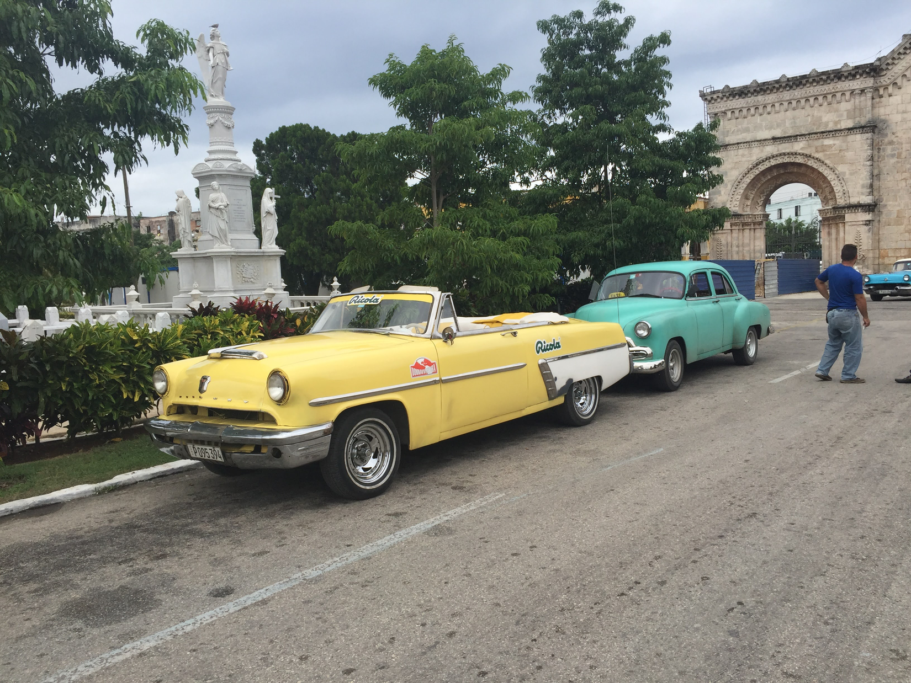
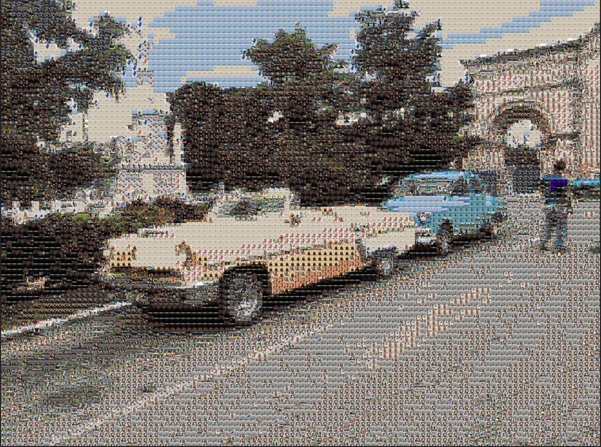

## Generating photomosaics

Notebook for generating [photomosaics](https://en.wikipedia.org/wiki/Photographic_mosaic).

### So what are those? 

Kind of pixellated high-res replicas of a given input image, formed by stitching together other images. Something like this but with square images (*image from Wikipedia, By The original uploader was J2thawiki at English Wikipedia.*)

From distance, the new image should ideally very much resemble the original input image. When zooming in, we should be able to recognize the individual images used as "pixels".

### How?

On a high level: for each small region in the input image (the image that is to be reconstructed), we calculate the average color, find the image with most similar average color and use it to represent that part of the input image. With a big and varying collection of images to use and each image being tiny part of the generated image, we should be able to produce fairly good photomosaics.

So we need a somewhat large collection of images. An input image is defined, and the code will kind of replicate that by forming a corresponding, high-resolution "pixellated" image using smaller images from the image collection as "pixels".

### Example transformation

From:

To

### To be done:

 - it is now just a somewhat messy notebook -> refactor
 - some new ideas in the notebook
